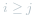
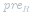
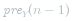
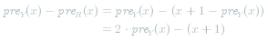
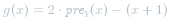
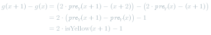
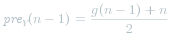

#### 方法一：动态规划

**思路与算法**

由于我们想要将收藏集中树叶的排列调整成「红、黄、红」三部分，因此我们可以用 *3* 个状态分别表示其中的每一部分，即状态 *0* 和状态 *2* 分别表示前面和后面的红色部分，状态 *1* 表示黄色部分。

此时，我们就可以尝试使用动态规划解决本题了。我们用 *f[i][j]* 表示对于第 *0* 片到第 *i* 片叶子（记为 ![\textit{leaves}\[0..i\] ](./p__textit{leaves}_0..i__.png) ）进行调整操作，并且**第 *i* 片叶子处于状态 *j*** 时的最小操作次数。在推导状态转移方程时，我们可以分别对于每一种状态进行分析。

- 当 *j=0* 时，我们需要将第 *i* 片叶子变成红色，并且第 *i-1* 片叶子也只能处于 *j=0* 的状态（因为没有编号更小的状态了），因此有状态转移方程：

    ![f\[i\]\[0\]=f\[i-1\]\[0\]+\text{isYellow}(i) ](./p_______f_i__0__=_f_i-1__0__+_text{isYellow}_i_______.png) 

    其中   为示性函数，当第 *i* 片叶子为黄色时为 *1*，红色时为 *0*。

- 当 *j=1* 时，我们需要将第 *i* 片叶子变成黄色，而第 *i-1* 片叶子既可以处于 *j=1* 的状态，也可以处于 *j=0* 的状态，我们选择其中的较小值，因此有状态转移方程：

    ![f\[i\]\[1\]=\min\{f\[i-1\]\[0\],f\[i-1\]\[1\]\}+\text{isRed}(i) ](./p_______f_i__1__=_min_{_f_i-1__0_,_f_i-1__1__}_+_text{isRed}_i_______.png) 

    其中   为示性函数，当第 *i* 片叶子为红色时为 *1*，黄色时为 *0*。

- 当 *j=2* 时，我们需要将第 *i* 片叶子变成红色，而第 *i-1* 片叶子即可以处于 *j=2* 的状态，也可以处于 *j=1* 的状态（**注意这里不能处于 *j=0* 的状态，因为每一种状态包含的叶子数量必须至少为 *1***），我们选择其中的较小值，因此有状态转移方程：

    ![f\[i\]\[2\]=\min\{f\[i-1\]\[1\],f\[i-1\]\[2\]\}+\text{isYellow}(i) ](./p_______f_i__2__=_min_{_f_i-1__1_,_f_i-1__2__}_+_text{isYellow}_i_______.png) 

最终的答案即为 *f[n-1][2]*，其中 *n* 是字符串   的长度，也就是树叶的总数。

**细节**

由于 **因为每一种状态包含的叶子数量必须至少为 *1***，因此不仅需要特别注意 *j=2* 时的状态转移方程，还需要考虑每个状态本身是否是符合要求的。对于状态 *f[i][j]* 而言，它包含了 ![\textit{leaves}\[0..i\] ](./p__textit{leaves}_0..i__.png)  共 *i+1* 片叶子以及 *j+1* 个状态，因此 **叶子的数量必须大于等于状态的数量**，即满足  。这样一来，所有 *i < j* 的状态 *f[i][j]* 都是不符合要求的。观察上面的状态转移方程，我们在每一步转移时都是取最小值，因此我们可以将所有不符合要求的状态置为一个极大值（例如 *n+1* 或整数类型的上限等）。

同时需要注意的是，当 *i=0* 时，*f[i][..]* 会从 *f[i-1][..]* 转移而来，但后者是没有意义的，因此我们需要对 *f[i][..]* 进行特殊处理。由于当 *i=0* 时，*j* 也只能为 *0*，因此我们有：

![f\[0\]\[0\]=\text{isYellow}(0) ](./p___f_0__0__=_text{isYellow}_0___.png) 

作为唯一的边界条件。

**代码**

```C++ [sol1-C++]
class Solution {
public:
    int minimumOperations(string leaves) {
        int n = leaves.size();
        vector<vector<int>> f(n, vector<int>(3));
        f[0][0] = (leaves[0] == 'y');
        f[0][1] = f[0][2] = f[1][2] = INT_MAX;
        for (int i = 1; i < n; ++i) {
            int isRed = (leaves[i] == 'r');
            int isYellow = (leaves[i] == 'y');
            f[i][0] = f[i - 1][0] + isYellow;
            f[i][1] = min(f[i - 1][0], f[i - 1][1]) + isRed;
            if (i >= 2) {
                f[i][2] = min(f[i - 1][1], f[i - 1][2]) + isYellow;
            }
        }
        return f[n - 1][2];
    }
};
```

```Java [sol1-Java]
class Solution {
    public int minimumOperations(String leaves) {
        int n = leaves.length();
        int[][] f = new int[n][3];
        f[0][0] = leaves.charAt(0) == 'y' ? 1 : 0;
        f[0][1] = f[0][2] = f[1][2] = Integer.MAX_VALUE;
        for (int i = 1; i < n; ++i) {
            int isRed = leaves.charAt(i) == 'r' ? 1 : 0;
            int isYellow = leaves.charAt(i) == 'y' ? 1 : 0;
            f[i][0] = f[i - 1][0] + isYellow;
            f[i][1] = Math.min(f[i - 1][0], f[i - 1][1]) + isRed;
            if (i >= 2) {
                f[i][2] = Math.min(f[i - 1][1], f[i - 1][2]) + isYellow;
            }
        }
        return f[n - 1][2];
    }
}
```

```Python [sol1-Python3]
class Solution:
    def minimumOperations(self, leaves: str) -> int:
        n = len(leaves)
        f = [[0, 0, 0] for _ in range(n)]
        f[0][0] = int(leaves[0] == "y")
        f[0][1] = f[0][2] = f[1][2] = float("inf")

        for i in range(1, n):
            isRed = int(leaves[i] == "r")
            isYellow = int(leaves[i] == "y")
            f[i][0] = f[i - 1][0] + isYellow
            f[i][1] = min(f[i - 1][0], f[i - 1][1]) + isRed
            if i >= 2:
                f[i][2] = min(f[i - 1][1], f[i - 1][2]) + isYellow
        
        return f[n - 1][2]
```

```Golang [sol1-Golang]
const inf = math.MaxInt32 // 或 math.MaxInt64

func minimumOperations(leaves string) int {
    n := len(leaves)
    f := make([][3]int, n)
    f[0][0] = boolToInt(leaves[0] == 'y')
    f[0][1] = inf
    f[0][2] = inf
    f[1][2] = inf
    for i := 1; i < n; i++ {
        isRed := boolToInt(leaves[i] == 'r')
        isYellow := boolToInt(leaves[i] == 'y')
        f[i][0] = f[i-1][0] + isYellow
        f[i][1] = min(f[i-1][0], f[i-1][1]) + isRed
        if i >= 2 {
            f[i][2] = min(f[i-1][1], f[i-1][2]) + isYellow
        }
    }
    return f[n-1][2]
}

func boolToInt(b bool) int {
    if b {
        return 1
    }
    return 0
}

func min(a, b int) int {
    if a < b {
        return a
    }
    return b
}
```

```C [sol1-C]
int minimumOperations(char* leaves) {
    int n = strlen(leaves);
    int f[n][3];
    f[0][0] = (leaves[0] == 'y');
    f[0][1] = f[0][2] = f[1][2] = INT_MAX;
    for (int i = 1; i < n; ++i) {
        int isRed = (leaves[i] == 'r');
        int isYellow = (leaves[i] == 'y');
        f[i][0] = f[i - 1][0] + isYellow;
        f[i][1] = fmin(f[i - 1][0], f[i - 1][1]) + isRed;
        if (i >= 2) {
            f[i][2] = fmin(f[i - 1][1], f[i - 1][2]) + isYellow;
        }
    }
    return f[n - 1][2];
}
```

**复杂度分析**

- 时间复杂度：*O(n)*，其中 *n* 是字符串   的长度。

- 空间复杂度：*O(n)*。
  
  - 可以使用「降维」优化，用三个变量代替状态数组，即可将空间复杂度降低到 *O(1)*。具体操作留给读者自行实现。

#### 方法二：前缀和 + 动态规划

**思路与算法**

我们也可以尝试从整体的角度考虑这个问题。

假设我们希望将 ![\textit{leaves}\[0..x\] ](./p__textit{leaves}_0..x__.png) ，![\textit{leaves}\[x+1..y\] ](./p__textit{leaves}_x+1..y__.png)  以及 ![\textit{leaves}\[y+1..n-1\] ](./p__textit{leaves}_y+1..n-1__.png)  分别作为每一部分，那么需要的操作次数为：

 

如果我们枚举 *x* 和 *y*，并且使用前缀和的思路快速计算出上面的三项累加和，那么时间复杂度为 *O(n^2)*，无法通过本题。因此我们可以考虑枚举一个位置（例如 *y*）并找出可以使得上述累加和达到最小值的 *x*。

我们用   表示   的前缀和，  表示   的前缀和。当我们枚举 *y* 时，分别考虑这三项累加和：

- 第一项即为  ；

- 第二项可以进行拆分，即为  ；

- 第三项也可以进行拆分，即为  。

那么上述的累加和可以写成：

 

其中   是定值，  与 *y* 无关，  与 *y* 相关。

因此，当我们枚举 *y* 时，我们只要选择最小的   即可。这个最小值可以在枚举 *y* 的同时进行记录。

**细节**

上述方法只需要预处理出   和   即可，但还有更加方便的方法。我们可以注意到：

 

恒成立，因此有：

 

令  ，累加和可以继续改写成：

 

并且 *g* 有递推式：

 

因此我们只需要在枚举 *y* 的同时计算 *g* 值即可，并且   这一常数项可以留在最后再累加，它就等于：

 

**代码**

```C++ [sol2-C++]
class Solution {
public:
    int minimumOperations(string leaves) {
        int n = leaves.size();
        int g = (leaves[0] == 'y' ? 1 : -1);
        int gmin = g;
        int ans = INT_MAX;
        for (int i = 1; i < n; ++i) {
            int isYellow = (leaves[i] == 'y');
            g += 2 * isYellow - 1;
            if (i != n - 1) {
                ans = min(ans, gmin - g);
            }
            gmin = min(gmin, g);
        }
        return ans + (g + n) / 2;
    }
};
```

```Java [sol2-Java]
class Solution {
    public int minimumOperations(String leaves) {
        int n = leaves.length();
        int g = leaves.charAt(0) == 'y' ? 1 : -1;
        int gmin = g;
        int ans = Integer.MAX_VALUE;
        for (int i = 1; i < n; ++i) {
            int isYellow = leaves.charAt(i) == 'y' ? 1 : 0;
            g += 2 * isYellow - 1;
            if (i != n - 1) {
                ans = Math.min(ans, gmin - g);
            }
            gmin = Math.min(gmin, g);
        }
        return ans + (g + n) / 2;
    }
}
```

```Python [sol2-Python3]
class Solution:
    def minimumOperations(self, leaves: str) -> int:
        n = len(leaves)
        g = (1 if leaves[0] == "y" else -1)
        gmin = g
        ans = float("inf")

        for i in range(1, n):
            isYellow = int(leaves[i] == "y")
            g += 2 * isYellow - 1
            if i != n - 1:
                ans = min(ans, gmin - g)
            gmin = min(gmin, g)
        
        return ans + (g + n) // 2
```

```Golang [sol2-Golang]
const inf = math.MaxInt32 // 或 math.MaxInt64

func minimumOperations(leaves string) int {
    n := len(leaves)
    g := -1
    if leaves[0] == 'y' {
        g = 1
    }
    gmin := g
    ans := inf
    for i := 1; i < n; i++ {
        isYellow := boolToInt(leaves[i] == 'y')
        g += 2*isYellow - 1
        if i != n-1 {
            ans = min(ans, gmin-g)
        }
        gmin = min(gmin, g)
    }
    return ans + (g+n)/2
}

func boolToInt(b bool) int {
    if b {
        return 1
    }
    return 0
}

func min(a, b int) int {
    if a < b {
        return a
    }
    return b
}
```

```C [sol2-C]
int minimumOperations(char* leaves) {
    int n = strlen(leaves);
    int g = (leaves[0] == 'y' ? 1 : -1);
    int gmin = g;
    int ans = INT_MAX;
    for (int i = 1; i < n; ++i) {
        int isYellow = (leaves[i] == 'y');
        g += 2 * isYellow - 1;
        if (i != n - 1) {
            ans = fmin(ans, gmin - g);
        }
        gmin = fmin(gmin, g);
    }
    return ans + (g + n) / 2;
}
```

**复杂度分析**

- 时间复杂度：*O(n)*，其中 *n* 是字符串   的长度。

- 空间复杂度：*O(1)*。